# ChatBot Educational Research

# Outstanding tasks

*Personal to-do list — chatbot-code and study-design items I want to tackle. Collaborators can skip this section.*

- [x] Ensure the settings are logged.
- [x] Sign in to the chatbot
- [x] Way to disable chatbot
- [x] Enable task awareness in chatbot (subject dependent) and student name aware —> Not really needed
- [ ] Digitize surveys → task aware?
- [ ] Settle observer protocol for student↔instructor interactions (granularity, topic coding) — discuss with collaborators. Treated as a third outcome, not a control.

# Research question

Does access to an AI chatbot during a robotics programming task improve students' ability to solve the task? We distinguish three possible effects:

- **Performance**: students accomplish more when the chatbot is available in real time.
- **Learning**: students internalize understanding that persists after the chatbot is removed.
- **Instructor interaction**: students consult the human instructors differently — more, less, or about different things — when the chatbot is available.

The first two are not the same, and that is the point. The chatbot could plausibly produce *better robots without better understanding*: students might implement what the chatbot suggests, end up with programs that work, and have little grasp of why. The reverse is also possible — students forced to think hard about the chatbot's suggestions could end up understanding the material better even when the produced artifact is no different. Measuring only one of the two would miss this dissociation. We therefore measure both, treat them as separate constructs, and let the contrast between them be one of the study's main outputs.

The third effect is one a reviewer will reasonably press on, and is a substantive outcome in its own right. If students seek out the instructor far less when the chatbot is available, the chatbot is substituting for human help. If interaction is unchanged, the chatbot is supplementing rather than replacing it. If students ask *different kinds* of questions in the two conditions, the chatbot is reshaping where human help is most needed. Each of these is a real result, and not measuring it would leave an obvious question open.

# Study design

Below, I first sketch the ideal design — what we would run if practicalities allowed — and then the design we actually adopt. The latter is not confound-free, but it is constructed to be robust against the confounds most likely to matter in a class of this size and structure.

## The ideal design

Ideally we would split the class into four independent groups and counterbalance two factors across them: **chatbot order** (on→off vs. off→on) and **task order** (T1→T2 vs. T2→T1). Crossing these two factors produces four condition sequences, one per group, so that every student does both tasks under both chatbot states, but the two orderings are decoupled across the class:

| Group 1        | Group 2        | Group 3        | Group 4        |
| -------------- | -------------- | -------------- | -------------- |
| T1/ChatBot on  | T2/ChatBot on  | T1/ChatBot off | T2/ChatBot off |
| T2/ChatBot off | T1/ChatBot off | T2/ChatBot on  | T1/ChatBot on  |

This is impractical because the chatbot toggle and task assignment both occur at the class level: 24 students in one room cannot run different conditions simultaneously. The design adopted below is the closest counterbalanced approximation we can run inside that constraint.

## Latin-square reversal across two days

Two structural facts force the shape of this design. The chatbot has to be on or off for the whole room at any given moment, so chatbot can only vary *across* slots, not within. And the course already runs two modules on two separate days (color vision, then sound localization), each with two distinct tasks — giving us four natural slots, two per day.

Within those constraints we adopt the following layout. We split the class in half and flip which chatbot state comes first across days; within each day, the two halves complete the tasks in opposite order. Every student then experiences both chatbot states and both tasks per module, and task order is counterbalanced with respect to chatbot state.

**Slot schedule.**

| Slot | Day                        | Chatbot | Half A task    | Half B task    |
| ---- | -------------------------- | ------- | -------------- | -------------- |
| 1    | Day 1 (Color vision)       | on      | Mimic Color    | Approach Color |
| 2    | Day 1 (Color vision)       | off     | Approach Color | Mimic Color    |
| 3    | Day 2 (Sound localization) | off     | Kinesis        | Taxis          |
| 4    | Day 2 (Sound localization) | on      | Taxis          | Kinesis        |

Each slot in the schedule ends with two pieces of data collection. For the production rubric we collect each student's robot program and a photo of their robot. For the learning rubric, students answer the rubric questions for that slot's task via an online survey, without chatbot access.

**What this layout buys us.** Reading the chatbot column top to bottom, the chatbot manipulation in temporal order of slots is the vector **[1, 0, 0, 1]**. Any confound whose 4-slot pattern is orthogonal to this vector cancels in the chatbot contrast. Concretely, that includes:

- Monotonic time-on-robot effects (pattern [1, 2, 3, 4]) — students get better with practice across slots.
- Within-day position effects that repeat across days (pattern [1, 0, 1, 0]) — e.g., students always perform a bit worse on the second task of the day.
- Uniform day-level shifts (pattern [0, 0, 1, 1]) — e.g., a Day-2 mood or fatigue effect.

Equivalently, anything that decomposes additively into `day + within-day position` washes out.

**What it does not fix.** Day × position interactions — effects whose 4-slot pattern correlates with [1, 0, 0, 1] — do not cancel. The most plausible such interaction is **asymmetric carryover**: chatbot-imparted knowledge persisting from chatbot-on into chatbot-off (Day 1: attenuates the chatbot effect) versus generic practice carrying from chatbot-off into chatbot-on (Day 2: inflates the chatbot effect). If these two carryovers are roughly equal, they cancel; if not, residual bias remains.

**Diagnostic.** We report the Day 1 and Day 2 chatbot effects separately before pooling. Close agreement is consistent with small or symmetric carryover. Divergence is the fingerprint of asymmetric carryover, and the pooled estimate should be read with that bias in mind.

## Design notes

Students will have had experience with the chatbot before we roll out the design below. This gives them some time to get used to using it. We will also have data on their chatbot usage prior to the start of our experimental protocol.

# Assessment

We will assess whether the chatbot affects (1) production, (2) learning and understanding, and (3) student-initiated interaction with the human instructors.

| Construct              | Scored by                 | Scored from                                       |
| ---------------------- | ------------------------- | ------------------------------------------------- |
| Production             | Instructor / AI           | Code + robot photo                                |
| Learning               | AI (pairwise comparisons) | Student's written answers                         |
| Instructor interaction | Live observers            | Tally of student↔instructor interactions per slot |

### Methodological safeguards

- Students answer the learning rubric questions without chatbot access, in both conditions. Otherwise the learning track collapses into another performance measurement.
- Scoring of production rubrics should be blinded to condition and day.
- Instructors are present in all four slots, including the chatbot-on slots; chatbot availability changes, instructor availability does not. Otherwise interaction-frequency differences would confound chatbot use with instructor presence.
- Observers cannot be blind to chatbot condition (the room is on or off, visibly). Any subjective coding is anchored to a written scheme decided before Day 1, and intercoder agreement is reported on a sampled fraction of slots.

### Learning rubric design

The current image-based scaffolded format is a deliberate move away from two alternatives. Earlier versions used generic open-ended prompts (e.g., "explain how the robot decides which way to turn"), which gave students too much room for shallow handwaving. The image plus concrete numerical setup pins down the situation and forces a specific prediction.

Multiple-choice was also considered and rejected. MC would require designing distractor options that anticipate every interesting wrong answer — work the image-based scaffolding does without losing the depth signal that open-ended responses preserve.

### Scoring plan

- **Production rubrics.** Each item 0–3: absent/rudimentary/partial/clearly present.
- **Learning rubrics.** Pairwise comparison of anonymized answers. Adaptive Comparative Judgment (ACJ) to pick informative pairs — stable ranking in ~10–15×N comparisons rather than full pairwise. Multiple rounds / multiple AI models as judges; aggregate via Bradley-Terry to get interval scores.
- **Instructor-interaction observations.** Counts (and topic codes, if adopted) compiled directly from observer logs; no additional scoring step.

### Analysis plan

Three Bayesian mixed models, same predictors, different outcomes:

- **Production:** `sum score (0–15) ~ chatbot + day + position + task + (1|student)`
- **Learning:** `z-scored BT score ~ chatbot + day + position + task + (1|student) + (1|question)`
- **Instructor interaction:** `student-initiated interaction count ~ chatbot + day + position + task + (1|student)` with a Poisson or negative binomial likelihood. This model is contingent on per-student observation granularity; if we end up with per-half or per-slot counts, the third track collapses to a descriptive comparison rather than a fitted model.

Reporting is in estimation terms — point estimates with credible intervals — not null-hypothesis testing. We do not threshold on p-values. The dissociations between the chatbot's production, learning, and instructor-interaction effects are reported as posterior contrasts across the three models, each with its own credible interval.

## Interaction assessment

*Across all four slots, live observers (not the lead instructor) record student-initiated interactions with any instructor present. The observation regime is identical across slots — instructors remain present and available throughout, including in the chatbot-on slots — so any difference in interaction reflects students' choice, not instructor availability.*

Two design decisions are still open and will be settled with collaborators before Day 1.

**Granularity — how finely interactions are tallied.**

- *Per-student counts.* Each interaction is identified to a student. ~96 data points (24 students × 4 slots), parallels the per-student structure of production and learning, supports a mixed model with student random effects. Most demanding on observers.
- *Per-half counts.* Tally per 12-student half per slot. 8 data points. Cheaper to collect, no per-student structure, much weaker statistical power.
- *Per-slot aggregate only.* One total count per slot — 4 numbers across the study. Easiest to collect; descriptive only.

**Topic coding — what gets recorded about each interaction.**

- *Fixed small scheme.* ~5 categories agreed before Day 1, e.g., {programming/syntax, robot mechanics, biology concept, task interpretation, off-task}. Observers trained on the scheme; intercoder agreement reported on jointly-coded slots.
- *Counts only, no topic.* How many interactions, not what they were about. Loses the question of whether the chatbot displaces a *type* of help.
- *Free-text notes.* A short note per interaction; coding is done after the fact. Richer but slower and harder to standardize across observers.

Independent of the choices above, we plan to tag each interaction by *initiator* — student-asked vs instructor-approached. The two answer different questions (felt need for help vs allocation of instructor attention) and should not be pooled.

## Color vision assessment tools

### Production rubric: Mimic Color

*Scored from each student's robot program plus a photo of their robot, collected at the end of the slot in which they performed Mimic Color. Items rated 0–3 (absent / rudimentary / partial / clearly present); maximum 15.*

1. Are at least two sensors with different color filters used
2. Does the robot produce the correct output color for a given input color
3. Does the code use ratios or normalization to make the response intensity-invariant
4. Is there a mechanism for noise handling (averaging, thresholding)
5. Can the robot mimic more than two distinct colors (requires combining channels, not just thresholding each independently)

### Production rubric: Approach Color

*Scored from each student's robot program plus a photo of their robot, collected at the end of the slot in which they performed Approach Color. Items rated 0–3; maximum 15.*

1. Are at least two sensors with different color filters used
2. Does the robot compare measurements between rotations to decide which way to turn
3. Does the code use ratios or normalization to make the discrimination intensity-invariant
4. Is there a mechanism for noise handling (averaging, thresholding)
5. Can the robot handle multiple different distractor colors, not just one specific one (requires identifying the target by template matching, not by single-channel comparison)

### Learning rubric: Mimic Color

*Delivered as an online survey at the end of the slot in which the student performed Mimic Color. No chatbot access during the survey. The four questions form a scaffold parallel to the sound rubrics: bare light detector (Q1) → one filtered detector (Q2) → two filtered detectors with intensity invariance (Q3) → multi-channel template applied to mimic an unknown target color (Q4). As with the sound rubrics, every question is on a separate page and students cannot revisit earlier ones.*

---

**Q1**

<u>Image:</u> Robot facing forward with one bare light detector (no color filter). Three target LEDs at equal distance: red, green, blue.

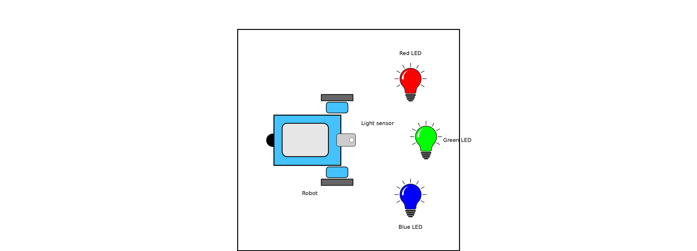

<u>Question text:</u> The robot has one light detector without a color filter. We light the three LEDs in succession (one at a time). How (if at all) do you expect the sensor's reading to differ across the three LEDs? Could the robot use this single detector to tell which LED is on? Explain.

---

**Q2**

<u>Image:</u> Same robot, but the single light detector now has a red filter placed in front of it. Same three target LEDs (red, green, blue), lit in succession.

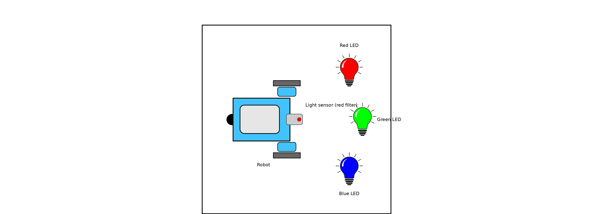

<u>Question text:</u> The robot has one light detector with a red filter. We light the three LEDs in succession. How (if at all) do you expect the sensor's reading to differ across the three LEDs? Explain.

---

**Q3**

<u>Image:</u> Robot with two light detectors at the front — one with a red filter, one with a green filter. A single cyan LED is placed in front of the robot.

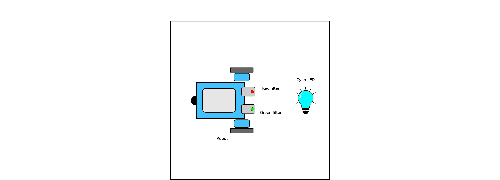

<u>Question text:</u> The robot has two light detectors, one with a red filter and one with a green filter. We light a cyan LED in front of the robot. How do you expect the red-filter and green-filter readings to compare? Explain.

---

**Q4**

<u>Image:</u> Robot with three light detectors at the front (red, green, and blue filters). Readings annotated next to each sensor: R = 200, G = 190, B = 50. The target LED is not shown.

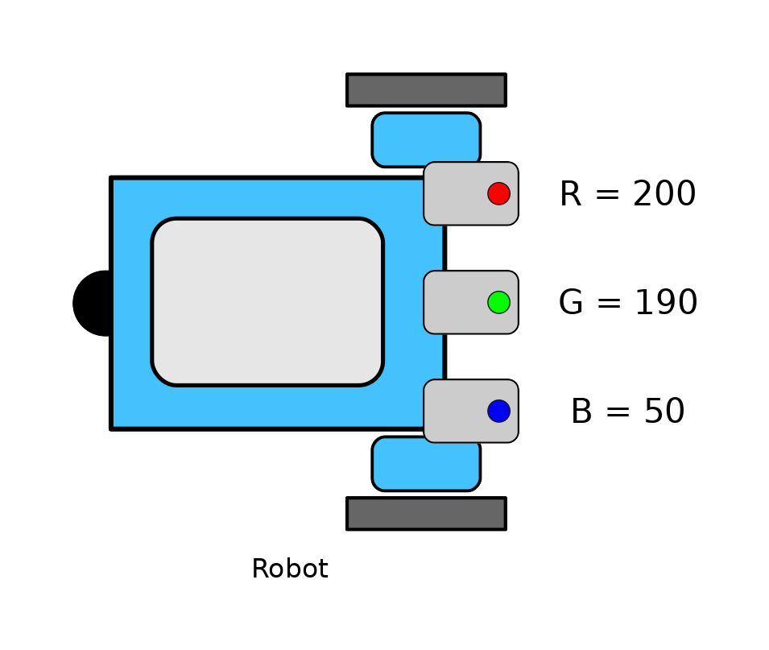

<u>Question text:</u> The robot has three light detectors with red, green, and blue filters. The readings are R = 200, G = 190, B = 50. Two candidate LEDs could be producing this pattern: a dim red LED, or a bright yellow LED. Which of the two matches the observed readings? Explain.

### Learning rubric: Approach Color

*Delivered as an online survey at the end of the slot in which the student performed Approach Color. No chatbot access during the survey. The four questions form a scaffold parallel to the other rubrics, with the student reconstructing the approach algorithm by Q4. As before, every question is on a separate page and students cannot revisit earlier ones.*

---

**Q1**

<u>Image:</u> Two panels. The robot has one bare light detector (no color filter). A red LED and a green LED are placed at fixed positions NW and NE of the robot, at equal distance. Panel 1: robot's body turned toward the green LED. Panel 2: robot's body turned toward the red LED.

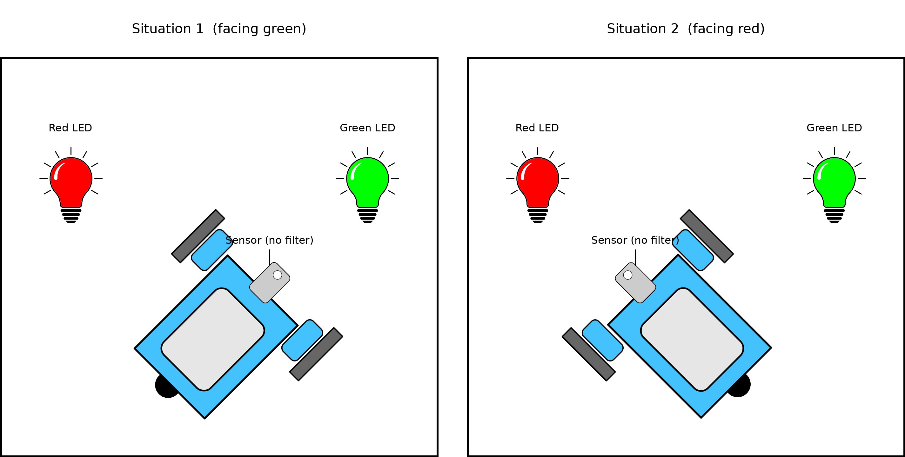

<u>Question text:</u> The robot has one light detector without a color filter. A red LED and a green LED are placed in front of it, equally distant. Panel 1 shows the robot turned toward the green LED; panel 2 shows it turned toward the red LED. How (if at all) do you expect the sensor's reading to differ between the two panels? Explain.

---

**Q2**

<u>Image:</u> Same two-panel setup as Q1, but the single light detector now has a red filter instead of being bare.

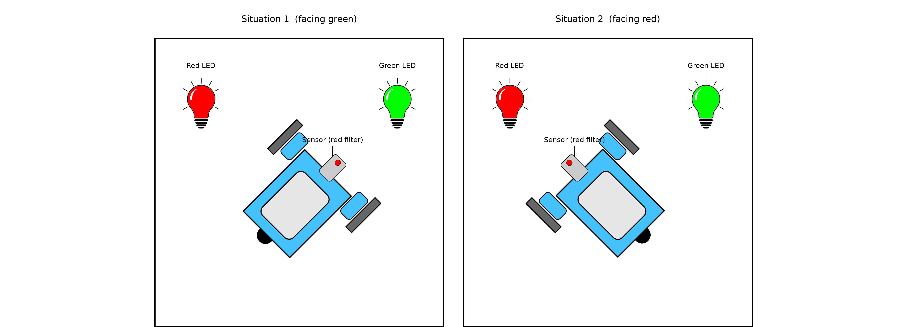

<u>Question text:</u> The robot has one light detector with a red filter. A red LED and a green LED are placed in front of it, equally distant. Panel 1 shows the robot turned toward the green LED; panel 2 shows it turned toward the red LED. How (if at all) do you expect the sensor's reading to differ between the two panels? Explain.

---

**Q3**

<u>Image:</u> Same two-panel layout as Q2, but the robot now has *two* light detectors at the front — one with a red filter, one with a green filter. A red LED and a green LED are placed at fixed positions NW and NE of the robot. Panel 1: robot turned toward the green LED. Panel 2: robot turned toward the red LED.

<u>Question text:</u> The robot has two light detectors at the front — one with a red filter and one with a green filter. A red LED and a green LED are placed in front of it, equally distant. Panel 1 shows the robot turned toward the green LED; panel 2 shows it turned toward the red LED. For each panel, how do you expect the red-filter and green-filter readings to compare with each other? Explain.

---

**Q4**

<u>Image:</u> Two panels. The robot has two light detectors at the front — one with a green filter, one with a blue filter. A white LED and a cyan LED are placed at fixed positions, equally distant from the robot. Panel 1: body turned toward the cyan LED, with readings annotated (G = 205, B = 210). Panel 2: body turned toward the white LED, with readings annotated (G = 210, B = 200).

<u>Question text:</u> The robot's task is to turn toward the cyan LED. It has two light detectors — one with a green filter, one with a blue filter. The two panels show what the robot reads when facing the cyan LED versus the white LED. Can the robot reliably tell which LED it is facing, and use these readings to approach the cyan LED specifically? Explain.

## Sound localization assessment tools

### Production rubric: Taxis

*Scored from each student's robot program plus a photo of their robot, collected at the end of the slot in which they performed Taxis. Items rated 0–3; maximum 15.*

1. Does the robot have two ears with clearly different acoustic axes
2. Does the code compare the loudness at the left and right ears
3. Does the rotation sign match the sign of the IID
4. Is there a mechanism for noise handling
5. Is there a mechanism for stopping at the goal

### Production rubric: Kinesis

*Scored from each student's robot program plus a photo of their robot, collected at the end of the slot in which they performed Kinesis. Items rated 0–3; maximum 15.*

1. Does the robot have a single directional ear
2. Does the robot compare the measurements between rotations
3. Does the rotation sign match the loudness difference sign
4. Is there a mechanism for noise handling
5. Is there a mechanism for stopping at the goal

### Learning rubric: Kinesis

*Delivered as an online survey at the end of the slot in which the student performed Kinesis. No chatbot access during the survey. The four questions form a scaffold: each builds on what the previous one established, with the student reconstructing the kinesis algorithm by Q4. To measure whether each step is reached on its own, every question appears on a separate page and students cannot revisit earlier ones — otherwise later questions, which reveal setup information, would let them backfill earlier answers in hindsight.*

---

**Q1**

<u>Image:</u> Robot with one bare sound sensor. Two speakers at equal distance: speaker 1 at 0°, speaker 2 at 45°.

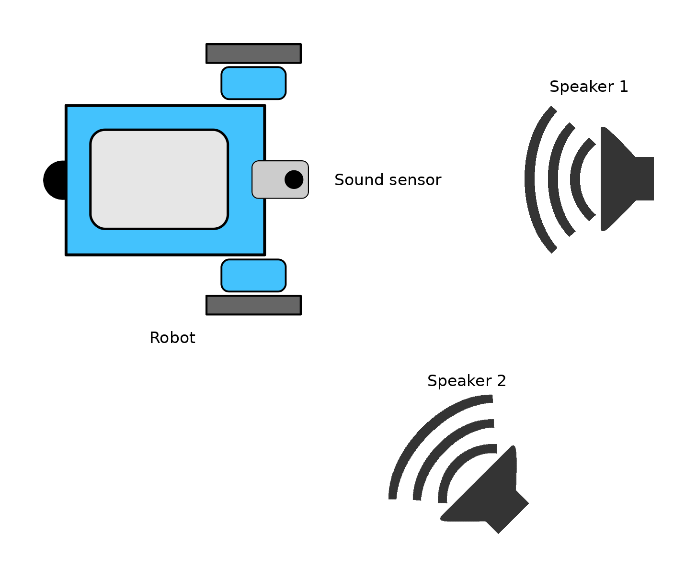

<u>Question text:</u> The robot is equipped with one sound sensor. We play sound from speakers 1 and 2 in succession. How (if at all) do you expect the sensor's reading to differ between the two speakers? Explain.

---

**Q2**

<u>Image:</u> Single speaker fixed at 45°. Three panels showing the robot at different body orientations — panel 1: robot faces 0°; panel 2: robot faces 45°; panel 3: robot faces 90°. The robot has one external ear, mounted at the center of the body and left/right symmetric. The ear points along the robot's forward axis and rotates with the body.

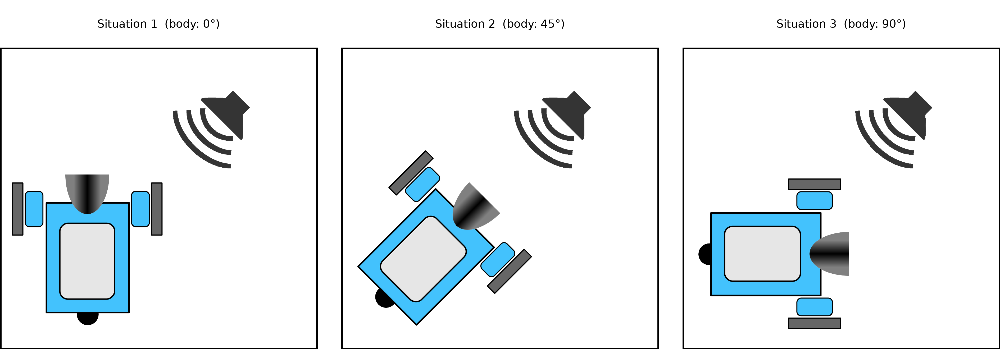

<u>Question text:</u> The robot is equipped with one sound sensor in an external ear. How do you expect the sensor's reading to differ across the three orientations? Explain.

---

**Q3**

<u>Image:</u> Robot with one external ear mounted at the front-center but tilted 45° from the body's forward axis (not pointing forward). The robot's body faces 0°, so the ear points at 45° absolute. Two speakers: speaker 1 at 0° (in front of the body), speaker 2 at 45° (in front of the ear).

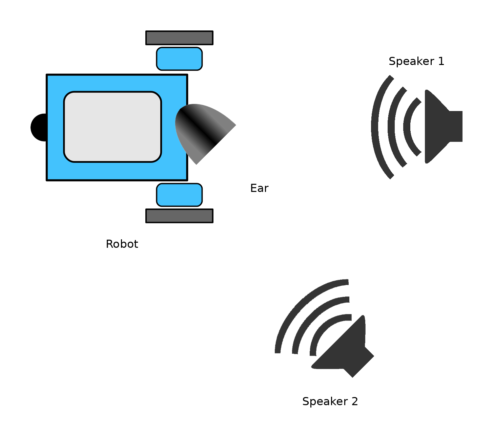

<u>Question text:</u> The robot is equipped with one sound sensor in an external ear. We play sound from speakers 1 and 2 in succession. Which speaker gives the louder reading? Explain — does the answer depend on where the body is facing, or where the ear is pointing?

---

**Q4**

<u>Image:</u> Two consecutive panels of the robot with a single directional ear. Panel 1: ear pointing at 0°, reading = 126. The robot rotates clockwise. Panel 2: ear pointing at 45°, reading = 233. The speaker's position is not shown.

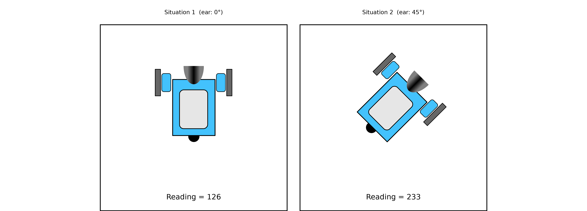

<u>Question text:</u> The robot is equipped with one sound sensor in an external ear. Based on these two readings, where do you think the speaker is? Explain.

### Learning rubric: Taxis

*Delivered as an online survey at the end of the slot in which the student performed Taxis. No chatbot access during the survey. The four questions form a scaffold parallel to the kinesis rubric, but built on simultaneous (two-eared) rather than sequential comparison: each question features two sensors. By Q4 the student has reconstructed the taxis algorithm. As with the kinesis rubric, every question is on a separate page and students cannot revisit earlier ones.*

---

**Q1**

<u>Image:</u> Robot with two bare sound sensors mounted at the front (one front-left, one front-right). Two speakers at equal distance: speaker 1 at 0°, speaker 2 at 45°.

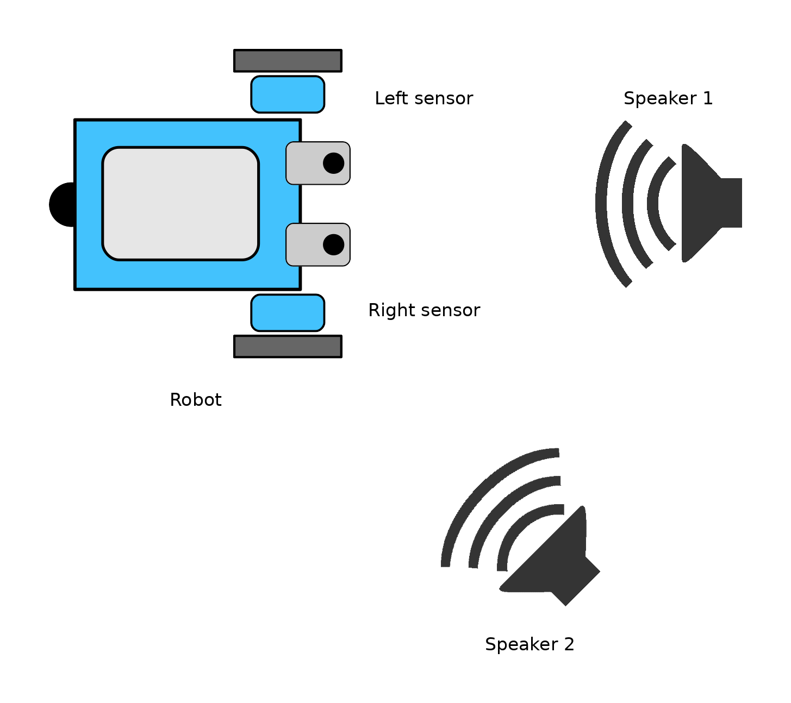

<u>Question text:</u> The robot is equipped with two sound sensors at the front. We play sound from speakers 1 and 2 in succession. For each speaker, how do you expect the left-sensor and right-sensor readings to compare with each other? And how do you expect the readings to differ between the two speakers? Explain.

---

**Q2**

<u>Image:</u> Robot with two external ears mounted at the front, both pointing along the body's forward axis. Three panels showing a single speaker at three positions — panel 1: speaker at 0°; panel 2: speaker at 45°; panel 3: speaker at 90°. The two ears are left/right symmetric, and any small reading difference due to their physical separation can be ignored as noise.

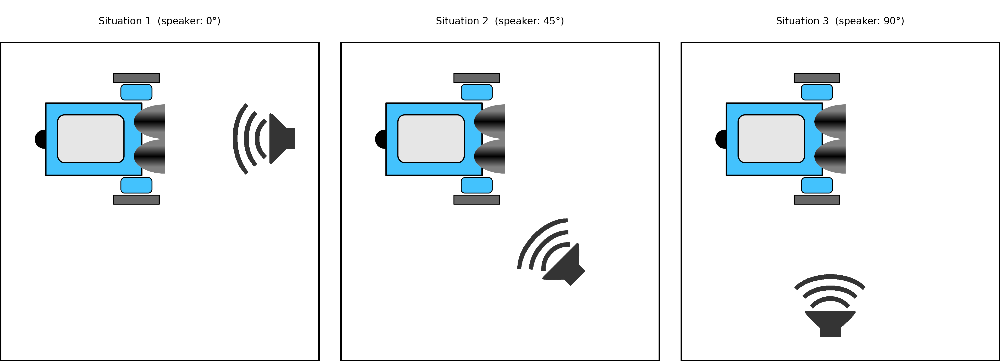

<u>Question text:</u> The robot has two sound sensors, each in an external ear, both pointing straight ahead. For each of the three speaker positions, how do you expect the left-ear and right-ear readings to compare with each other? And how do the readings differ across the three positions? Explain.

---

**Q3**

<u>Image:</u> Robot with two external ears mounted at the front but with divergent axes — the left ear points 45° to the left of forward, the right ear points 45° to the right of forward. Two panels — panel 1: single speaker straight ahead (0°); panel 2: single speaker at 30° to the right of forward.

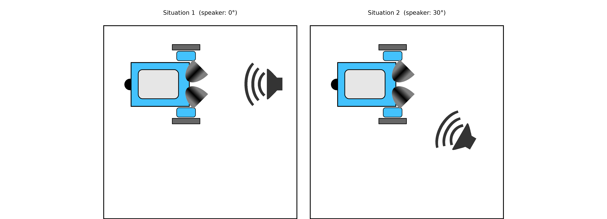

<u>Question text:</u> The robot has two sound sensors, each in an external ear, with divergent axes (left ear tilted left, right ear tilted right). For each panel, how do you expect the left-ear and right-ear readings to compare with each other? Explain.

---

**Q4**

<u>Image:</u> Robot with two external ears with divergent axes (left tilted left, right tilted right). Left-ear reading = 233. Right-ear reading = 126. The speaker's position is not shown.

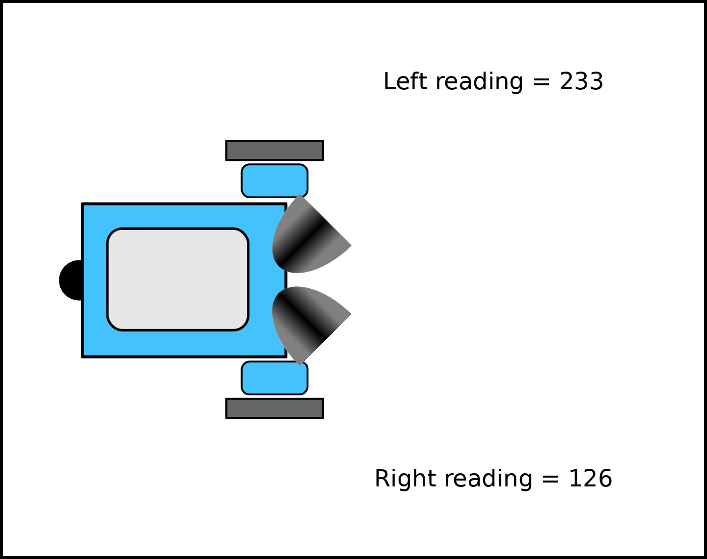

<u>Question text:</u> The robot has two sound sensors, each in an external ear, with divergent axes. Based on these two readings, where do you think the speaker is? Explain.